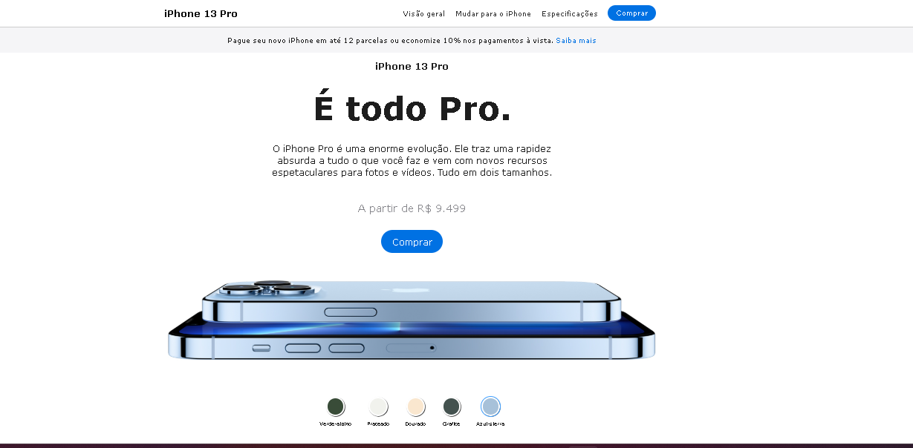

# 📱 iPhone 13 Pro - Página Responsiva

Uma página inspirada no site oficial da Apple, criada para prática de HTML, CSS e JavaScript, com layout **mobile-first** e adaptação para **tablet** e **desktop**.

---

## 🚀 Funcionalidades

- **Layout responsivo** para diferentes tamanhos de tela:
  - Mobile (≤ 480px)
  - Tablet (481–1024px)
  - Desktop (≥ 1025px)
- Seção de destaques com informações sobre recursos do iPhone 13 Pro
- Rodapé simples
- Estrutura de código limpa e organizada

---

## 📸 Preview

---

## 🌐 Demonstração

Você pode ver o site funcionando aqui:  
[🔗 **Clique para abrir**](https://seuusuario.github.io/iphone13-pro/)

## 🛠 Tecnologias usadas

- **HTML5**
- **CSS3** (Flexbox, Grid, Media Queries)
- **JavaScript (Vanilla)** — apenas para interações futuras
- **SVG e ícones vetoriais** opcionais

---

## 📂 Estrutura do projeto

